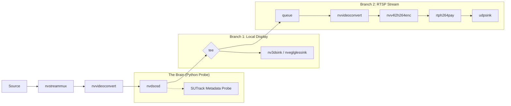

# Phase 5: DeepStream Native Integration & RTSP Streaming Plan

This plan outlines the transition from an **Appsink-OpenCV** architecture to a **Native Metadata-NvDsOsd** architecture. This is the industry-standard way to deploy DeepStream apps for maximum performance.

## 1. Architectural Shift

| Feature | Current (Phase 4) | Phase 5 (Native) |
| :--- | :--- | :--- |
| **BBox Drawing** | OpenCV `cv2.rectangle` (CPU) | `nvdsosd` (Hardware GPU) |
| **Logic Location** | Main Loop (pull-sample) | **GStreamer Pad Probe** (Inline) |
| **Frame Access** | NumPy (CPU Copy) | `NVMM` (GPU Memory) |
| **Output** | Display / File | **RTSP Stream** + Display |

## 2. GStreamer Pipeline Design

The new pipeline will use a "tee" to branch the output to both a local display and a network stream.

## 3. Implementation Steps

### Step 1: The Metadata Probe
We move the SUTrack `update()` call inside a GStreamer Pad Probe.
- **Input**: The probe intercepts the `GstBuffer`.
- **Action**: It uses `pyds` to extract the frame pointer (NVMM) and wraps it as a NumPy array for SUTrack (using `pyds.get_nvds_LayerInfo`).
- **Output**: It creates `NvDsObjectMeta` objects and attaches them to the frame's metadata.

### Step 2: RTSP Server Setup
We will use `GstRtspServer` (via Python bindings).
- The pipeline will output to a `udpsink` on a specific port (e.g., 5400).
- The `GstRtspServer` will "listen" to that port and wrap it in an RTSP stream (e.g., `rtsp://<jetson-ip>:8554/sutrack`).

### Step 3: Hardware Encoding
We will use the **NVENC** hardware block (`nvv4l2h264enc`) to ensure the H.264 compression does not impact the tracking FPS.

### Step 4: Automated & Hybrid ROI Initialization
Instead of standard manual selection which can drift, we support three modes:
1. **Static ROI**: Coordinates specified in `tracker_config.yml`.
2. **Snapshot Hybrid (Thread-Safe)**: 
   - The GStreamer probe captures the first frame and signals an event.
   - The probe thread **blocks** (waits), effectively freezing the video.
   - The **Main Thread** opens an OpenCV window for the user to select the ROI.
   - Once selected, the main thread unblocks the probe, and tracking begins from frame #1.
3. **PGIE Handover**: A standard detector automatically triggers trackers.

## 4. Key Advantages
1. **Zero-Copy Rendering**: Bounding boxes are drawn in GPU memory. The frame never touches the CPU during the drawing stage.
2. **Headless Stability**: Since it's a stream and we have a static ROI option, we don't need `DISPLAY=:0`, an X-Server, or a mouse for the system to function.
3. **Multi-Client Support**: Multiple people can view the tracking stream simultaneously via VLC.

## 5. Verification Checklist
- [x] Pipeline state transitions from NULL -> PLAYING without EGL errors.
- [x] `pyds` successfully attaches metadata (boxes appear on stream).
- [x] RTSP stream is accessible via `rtsp://localhost:8554/sutrack`.
- [x] Latency is minimal (< 200ms).

---
> [!IMPORTANT]
> This phase requires the `gi.repository.GstRtspServer` package, which is standard on JetPack but might need explicit installation if you are using a custom Docker container.
